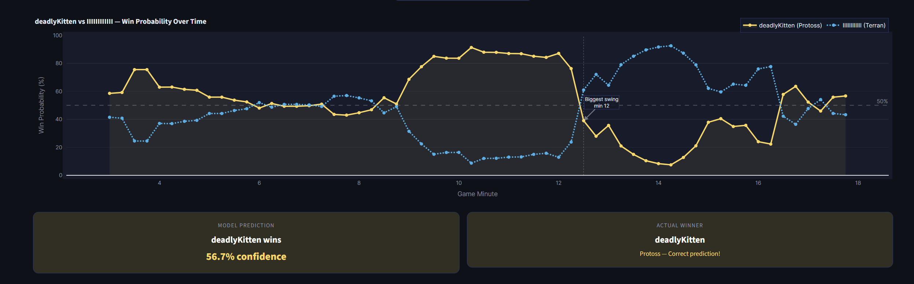

# StarCraft II Win Predictor

A machine learning model that predicts the winner of a StarCraft II game at any point in time. Upload a replay and see the win probability chart evolve minute by minute.

**Live app:** [winpredictorstarcraft.streamlit.app](https://winpredictorstarcraft.streamlit.app)



[Download a replay to try](https://drop.sc/replay/27172637)

---

## What it does

Upload a `.SC2Replay` file and the app will:

- Parse the replay and extract game statistics at 15-second intervals
- Predict each player's win probability from minute 3 onwards
- Show which features were driving the prediction at any given minute (SHAP explanation)
- Display the biggest momentum swings in the game

Supported matchups: **PvT, TvZ, TvT, PvZ, PvP**

---

## Model performance

Trained and evaluated on ~12,000 Master/Grandmaster replays. Accuracy and AUC are measured on a held-out test set.

| Matchup | Games | Accuracy | AUC  |
|---------|-------|----------|------|
| PvT     | 3,295 | 62.7%    | 0.691 |
| TvZ     | 2,710 | 61.4%    | 0.687 |
| TvT     | 1,340 | 61.6%    | 0.646 |
| PvZ     | 2,072 | 62.1%    | 0.643 |
| PvP     |   931 | 62.7%    | 0.679 |

Note: these numbers reflect honest evaluation with no data leakage — the model only uses information available at the given game minute, never future events.

---

## How the model works

### 1. Parsing replays

Each replay is parsed using [sc2reader](https://github.com/ggtracker/sc2reader), which reads the binary `.SC2Replay` format. The parser extracts two types of data:

**Economy snapshots** — taken every 30 seconds throughout the game:
- Minerals and gas (current and income rate)
- Worker count and army supply

**Event-based features** — extracted from specific game events:
- When each player took their natural and third base
- Which tech buildings were built and when
- Army and worker units lost (and when)
- Unit composition (bio, mech, gateway units etc.)
- Key upgrades completed (Stimpack, Blink, Metabolic Boost etc.)
- Opening build order (forge first, gate first, FFE etc.)

### 2. Feature engineering

For every 15-second checkpoint from minute 3 to minute 20, the parser builds a feature row containing:

- Raw stats for each player at that moment
- Rate-of-change stats (how fast each stat is growing)
- Spending efficiency (unspent resources relative to income)
- Supply block percentage
- Delta features (player 1 minus player 2 for every stat)

This gives roughly 150 features per checkpoint.

### 3. Model training

A separate **XGBoost** model is trained for each matchup (PvT, TvZ, TvT, PvZ, PvP). Hyperparameters are tuned using **Optuna** with 100 trials per matchup.

The training data is augmented by flipping each game (swapping P1/P2) to double the dataset size and ensure the model is symmetric.

Trained on approximately **12,000 replays** at Master/Grandmaster level.

### 4. SHAP explanations

Feature importance is computed using **SHAP TreeExplainer**, which breaks down each prediction into contributions from individual features. The app lets you slide to any game minute and see which features were most influential at that point.

---

## Project structure

```
src/parser.py              — Replay parser and feature engineering
notebooks/01_parse_replays — Parse all replays and save features to CSV
notebooks/02_matchup_models — Train matchup-specific XGBoost models
app.py                     — Streamlit web app
models/                    — Trained models and imputers
data/                      — Parsed feature data
```

---

## Running locally

```bash
git clone https://github.com/Berfil/WinPredictorStarcraft2
cd WinPredictorStarcraft2
python -m venv venv
venv/Scripts/activate
pip install -r requirements.txt
streamlit run app.py
```

The `models/` and `data/` folders are included in the repo so the app runs immediately after cloning — no retraining needed.

If you want to retrain from scratch with your own replays:
1. Put your `.SC2Replay` files in a `replays/` folder
2. Run `notebooks/01_parse_replays.ipynb` to parse them into features
3. Run `notebooks/02_matchup_models.ipynb` to train the models
